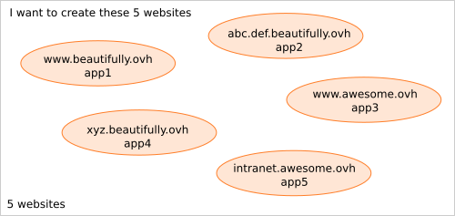
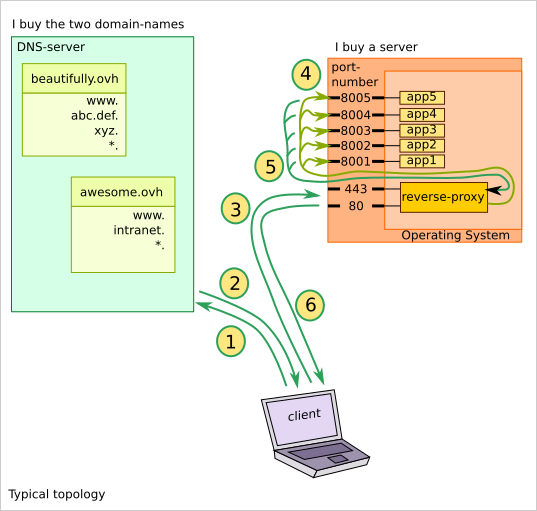

======================
Notes on host_registry
======================

Presentation
============

This document aims at exploring possibilities to setup a website.

Typical topology
================

Let's say, I want to create 5 websites with the following names:

I have to buy the two **domain-names**, *beautifully.ovh* and *awesomely.ovh*. I also have to buy a server (i.e. a computer working 24 hours a day and connected to internet), such as vps_, where my web-applications and databases will run.

For each *domain-name* I can register (almost) any sub-domains. For each sub-domain I can register a A-record (IPv4), a AAAA-record (IPv6) or a CNAME-record (i.e. an alias to an other hostanme) . The wilcard \* let you provide an IP-address to all sub-domains, not explicitly registered.

.. _vps: https://www.ovhcloud.com/en/vps/

With this typical topology, when someone wants to visit one of the websites from his client-laptop, the following sequence happens:

#. the laptop asks a DNS server the translation of the hostname of the URL
#. the DNS returns the corresponding IP-address
#. the laptop send the http-request to my server
#. the rever-proxy listening to the standard port-numbers forwards the requests
#. the web-application process the request and provides the result to the reverse-proxy
#. the reverse-proxy forward the result to the laptop

By the second http-request, the two first steps are skipped, as the laptop knows already the IP-address of my server.

The *reverse-proxy* manages to forward the requests to the right application thanks to the *destination-hostname* written in the *http-header*. So the *reverse-proxy* won't work if you replace the server-hostname with its IP-address in the URL.

Pros and Cons
-------------

Pros:

- the standard port-numbers are used in the http-request, so the port-number is not shown in the URL
- the reverse-proxy can also act as *load-balancer*

Cons:

- Websocket runs over the intermediate reverse-proxy
- restriction by ssl / https certificates
- the reverse-proxy process might become a bottle-neck
- the equivalence *ip-address:port* <> *hostname:port* is broken

The new fact
============

nodejs_ offers the capacity of directly serving http-requests from internet. Before nodejs_, when generating the html-pages with perl_, php_ or python_, a *revers-proxy*, such as apache_ or nginx_, was required.

.. _nodejs: https://nodejs.dev/
.. _perl: https://www.perl.org/
.. _php: https://www.php.net/
.. _python: https://www.python.org/
.. _apache: https://httpd.apache.org/
.. _nginx: https://nginx.org/

So now, each web-application, implemented with nodejs_, can directly face internet. The wish to get rid of the *reverse-proxy* is getting higher. Two options are described below:

- a port-redirection service
- a service-registry

Port-redirection
================

This solution is implemented in this git-repository.

By the second http-request, the four first steps are skipped, as the laptop knows already the IP-address and the port-number of the web-application.

Pros and Cons
-------------

Pros:

- each web-application works nicely independently. No central process.
- Websocket and https certificates are served directly
- the equivalence *ip-address:port* <> *hostname:port* works as expected

Cons:

- the port-numbers of the web-application if visible in the URL of the http-request

Service registry
================

The idea is more futuristic and not implemented yet.

Some more ideas for the service registry:

- hash instead of a service-name
- the service could update its IP-address and port-number dynamically
- the *load-balancing* could be implemented from the client-side (with a list of servers for each service)

