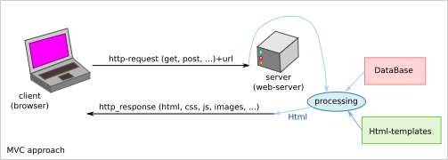

=========================
Notes on web-app concepts
=========================

Introduction
============

The world of web technologies is so prolific, that man may lost the direction. From time to time, we have to rethink: Which problematic? Which solutions?

The multi-user application
==========================

.. image:: n_agent_app.png

How to create one application for multiple users or agents?

The MVC approach is the historical solution. One big application running on one *central server* generates *html* interpreted remotely by browser. The most popular frameworks with the MVC approach are:

- ruby-on-rails_
- sails_

.. _ruby-on-rails: https://rubyonrails.org/
.. _sails: https://sailsjs.com/

The micro-service aims at transferring the core of the application on the client-side. The server-side is reduced to the minimum. The backend is split as much as possible in independent parts.

The frontend could be bundled in an electron_, nw_ or pwa_ application.

.. _electron: https://www.electronjs.org/
.. _nw: https://nwjs.io/
.. _pwa: https://developer.mozilla.org/en-US/docs/Web/Progressive_web_apps

